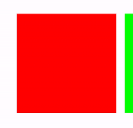
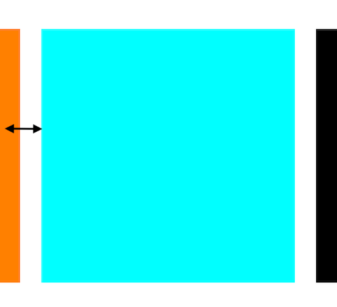
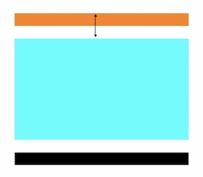
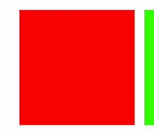

# paging-collection-view-layout
custom collection view layout that allows you to page by cell, not screen


## installation
### cocoapods
use [cocoapods](http://cocoapods.org/) to install `PagingCollectionViewLayout` by adding it to your `Podfile`:

```ruby
platform :ios, '9.0'
use_frameworks!
pod 'PagingCollectionViewLayout'
```

``` swift
import PagingCollectionViewLayout
```
### manual
add `PagingCollectionViewLayout.swift` to your project
## usage

instantiate a layout property

```swift
let layout = PagingCollectionViewLayout()
```
set the following properties
```swift
layout.itemSize = 
layout.minimumLineSpacing = 
layout.scrollDirection = .horizontal
```
instantiate a collection view using the layout property
```swift
let collectionView = UICollectionView(frame: .zero, collectionViewLayout: layout)
```
for snappy scrolling set the following
```swift
collectionView.decelerationRate = .fast
```

#### note:
~~collectionView.isPagingEnabled = true~~
## optional customization
### vertical scrolling

```swift
layout.scrollDirection = .vertical
```
or since the default is vertical

~~layout.scrollDirection = .horizontal~~
### section spacing
- center the item in focus
- allow the previous item to be visible




set the following property
```swift
layout.sectionInset = 
```
- **horizontal collection view -** set left and right insets
- **vertical collection view -** set top and bottom insets

### skipping items



`layout.velocityThresholdPerPage` determines the velocity needed to skip an item (default = 2.0)
- a non zero swipe velocity will result in the collection view scrolling to the prev/next item
- the number of items skipped = swipe velocity / velocityThresholdPerPage
